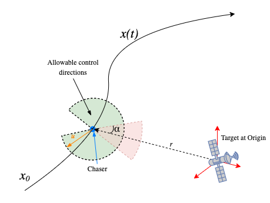

# Optimal RPOD Trajectories using Convex Optimization

Some tools to generate optimal trajectories using the convex optimization package available at http://cvxr.com/
If any publication results from the use of this software, please cite reference [1] or [2] below as relevant.

Two core functions: 

1. SuccessiveContaminationReductionUsingCVX.m - Recreates results in conference paper[1] where we implement a thruster pointing constrained control problem and solve it using a method of successive approximations. The constraint is illustrated in the figure below.

     

2. SOCP_OrtolanoResults.m - Replicates some results from Ortolano[2], namely rendezvous and proximity operations with a conical approach corridor and spherical keep-out zone using second order cone programming techniques.

**References**

[1] Panag H., Woollands R., Bandyopadhyay S. and Rahmani A., “Reducing Thruster Plume Contamination for Satellite Servicing Using Convex Optimization,” American Astronautical Society Guidance, Navigation and Controls Conference, Harvey Mamich, 2023, Paper AAS 23-016.

[2] Nicholas G Ortolano. Phd Thesis Autonomous Trajectory Planning for Satellite RPO and Safety of Flight Using Convex Optimization. PhD thesis, 2018.
